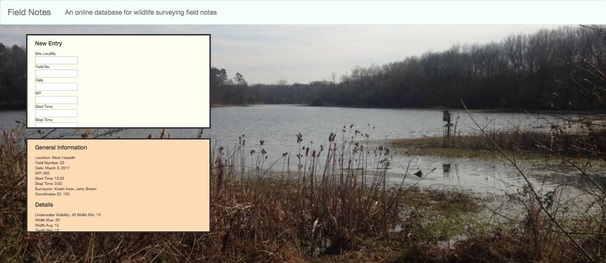

# Field Notes
Field Notes is an application that allows environmental scientist to upload their field notes and data sheets to a database for safe and secure surveying.

My twin sister does field work on the Harpeth River as part of her master’s thesis for the University of Tennessee in Knoxville. She still brings paper and pencil with her when she is out in the field, and I wanted to make an app that she could use in the field so she doesn’t risk losing her data as she works.

## About

Field Notes is built with Node.js and utilizes a Postgres database. Knex migrations and seeds allow for easy updating to form information and database query builds. The Bookshelf ORM helps keep the code modularized and Bootstrap allows clean and simple styling.

## Tech Stack
Node.js, Postgres, SQL, Express, Knex, Bookshelf, HTML5, CSS, Bootstrap, AngularJS

## App

Users can complete a form with all of the information from their field work data sheets and then add them to their online profile.

Interacting directly with the Postgres database, user's entries are safely added to their profile.

Users then can then immediately view all of their entries.

The updating content in the database populates the page when the user adds the latest entry.

## -Version 2- Coming Soon!-
-Version 2- Coming Soon!-

Upcoming Features-

User Authentication- Using Passport and Express Session, users can create profiles and control which users can view their field notes.
Search Features- Users can easily filter through their entries by date, surveyors, and location to compare notes.
Location Tracking- Using the Google Maps API, users can mark their excavation on a map for easy reviewing.
Deployment- Deployment through Heroku and GitHub Pages